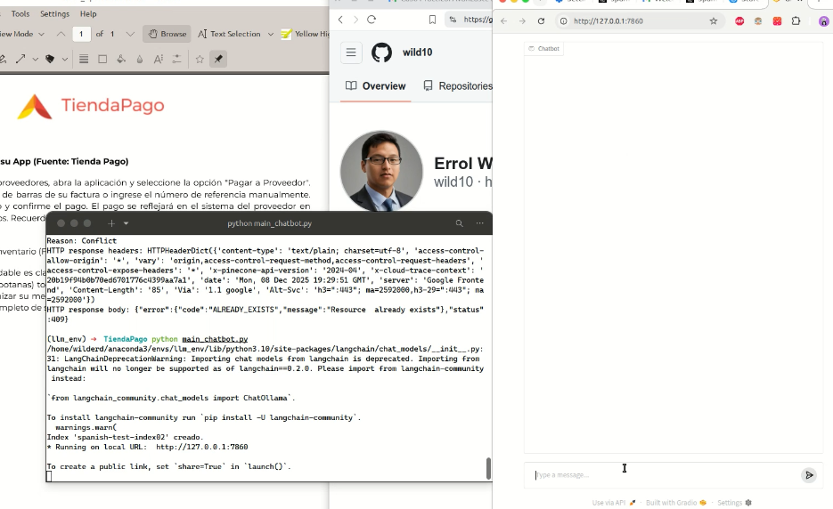

# Chatbot RAG con Pinecone, LangChain y Ollama, llma

Este proyecto implementa un **chatbot basado en RAG (Retrieval-Augmented Generation)**, que combina **documentos PDF** con un modelo de lenguaje para responder consultas de manera contextualizada. Utiliza **Pinecone** como vector store(escalable y cloud free) y **Ollama** como modelo de embeddings y LLM base se usa **LLAMA3** y alternativamente **gpt-4.1-mini**

---

## Características

- Indexación de documentos PDF para búsqueda semántica.
- Uso de **Pinecone** como vector database serverless.
- Creación de embeddings con **OllamaEmbeddings**.
- Generación de respuestas mediante **ChatOllama**.
- Interfaz interactiva con **Gradio**.
- Soporte para prompts personalizados.

---

## Tecnologías y librerías usadas

- Python 3.10+
- [Pinecone](https://www.pinecone.io/) — Vector database para búsqueda semántica.
- [LangChain](https://www.langchain.com/) — Framework para LLMs y RAG.
- [Ollama](https://ollama.com/) — Embeddings y chat models.
- [PyMuPDF](https://pymupdf.readthedocs.io/en/latest/) — Lectura y procesamiento de PDFs.
- [Gradio](https://gradio.app/) — Interfaz web interactiva.
- Librerías estándar: `os`, `re`.

---

## Dependencias y versiones

El proyecto utiliza las siguientes librerías y versiones (según tu entorno `llm_env`):

| Librería | Versión |
|----------|---------|
| langchain | 0.1.16 |
| langchain-classic | 1.0.0 |
| langchain-community | 0.0.32 |
| langchain-core | 0.2.43 |
| langchain-ollama | 1.0.0 |
| langchain-pinecone | 0.0.3 |
| langchain-tests | 0.3.15 |
| langchain-text-splitters | 0.0.2 |
| pinecone-client | 5.4.2 |
| PyMuPDF (fitz) | 1.25.4 |
| gradio | 5.22.0 |


> Se recomienda usar estas versiones exactas en un entorno virtual para asegurar compatibilidad.

---

## Configuración de Pinecone

1. Crea una cuenta en [Pinecone](https://www.pinecone.io/).
2. Obtén tu API Key y guárdala en tu entorno:(usado en codigo, para fines demostrativos)

```bash
export PINECONE_API_KEY="tu_api_key"

```

## Uso
Para ejecutar el chatbot, usa el siguiente comando:
```bash
source /home/wilderd/anaconda3/bin/activate
conda activate llm_env
python  main.py # chatbot llama3 free online local with ollama
python main_gpt.py # chatbot con api key chatg-gpt-4.1-mini
```


## Demo
[](demo.mp4)

